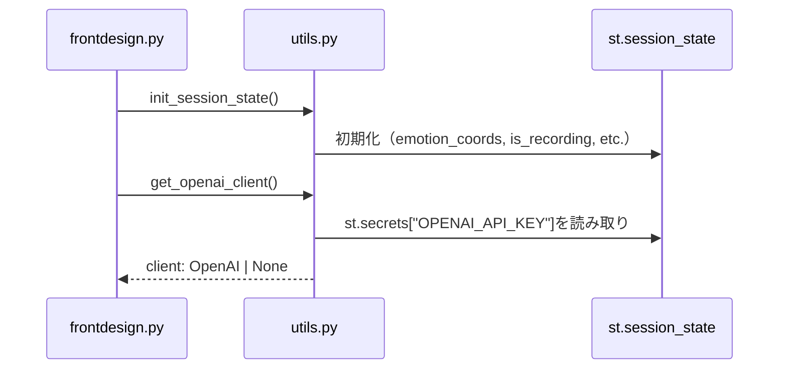
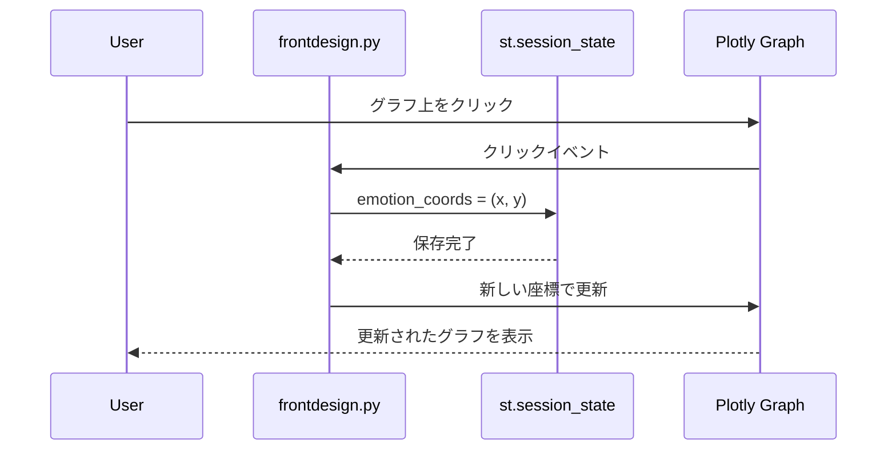
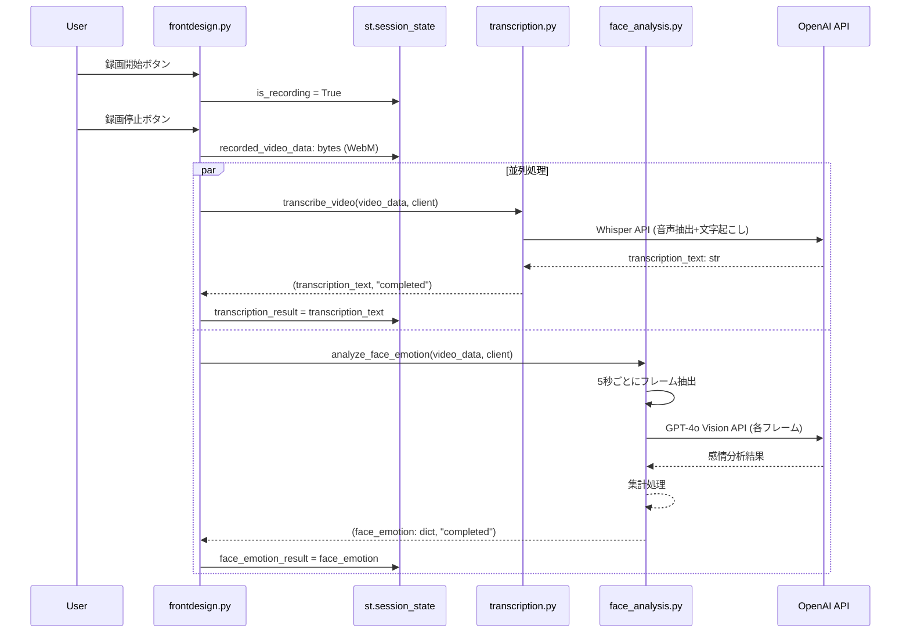
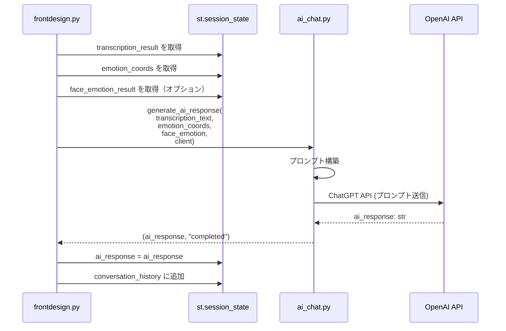

```mermaid
graph TD
    A[frontdesign.py<br/>フロントエンド] -->|init_session_state| B[utils.py<br/>共通ユーティリティ]
    A -->|get_openai_client| B
    
    subgraph "ステップ1: 感情入力"
        A -->|emotion_coords: tuple[float, float]| A1[st.session_state<br/>emotion_coords]
        A1 -->|Plotlyグラフでクリック| A
    end
    
    subgraph "ステップ2: 録画録音"
        A -->|録画開始/停止| A2[st.session_state<br/>recorded_video_data: bytes]
        A2 -->|WebM形式| A
        
        A -->|recorded_video_data: bytes<br/>client: OpenAI| C[services/transcription.py<br/>transcribe_video]
        C -->|transcription_text: str<br/>status: str| A
        A -->|transcription_result| A3[st.session_state<br/>transcription_result]
        
        A -->|recorded_video_data: bytes<br/>client: OpenAI| D[services/face_analysis.py<br/>analyze_face_emotion]
        D -->|face_emotion: dict<br/>status: str| A
        A -->|face_emotion_result| A4[st.session_state<br/>face_emotion_result]
    end
    
    subgraph "ステップ3: 対話結果"
        A3 -->|transcription_text: str| E[services/ai_chat.py<br/>generate_ai_response]
        A1 -->|emotion_coords: tuple| E
        A4 -->|face_emotion: dict\|None| E
        A -->|client: OpenAI| E
        E -->|ai_response: str<br/>status: str| A
        A -->|ai_response| A5[st.session_state<br/>ai_response]
    end
    
    style A fill:#e1f5ff
    style B fill:#fff4e1
    style C fill:#e8f5e9
    style D fill:#e8f5e9
    style E fill:#e8f5e9
    style A1 fill:#f3e5f5
    style A2 fill:#f3e5f5
    style A3 fill:#f3e5f5
    style A4 fill:#f3e5f5
    style A5 fill:#f3e5f5
```

## 詳細なデータフロー

### 1. 初期化フェーズ



### 2. ステップ1: 感情入力



### 3. ステップ2: 録画・文字起こし・表情認識



### 4. ステップ3: AI応答生成



## データ形式詳細

### 入力データ（Frontend → Backend）

| サービス | 関数 | 引数 | 型 | 説明 |
|---------|------|------|-----|------|
| `transcription.py` | `transcribe_video` | `video_data` | `bytes` | WebM形式の動画データ |
| | | `client` | `OpenAI` | OpenAIクライアントインスタンス |
| `face_analysis.py` | `analyze_face_emotion` | `video_data` | `bytes` | WebM形式の動画データ |
| | | `client` | `OpenAI` | OpenAIクライアントインスタンス |
| | | `interval_seconds` | `float` | フレーム抽出間隔（デフォルト: 5.0） |
| `ai_chat.py` | `generate_ai_response` | `transcription_text` | `str` | 文字起こし結果テキスト |
| | | `emotion_coords` | `tuple[float, float]` | 感情座標 (x, y)、範囲: -1.0～1.0 |
| | | `face_emotion` | `dict \| None` | 表情認識結果（オプション） |
| | | `client` | `OpenAI \| None` | OpenAIクライアントインスタンス |

### 出力データ（Backend → Frontend）

| サービス | 関数 | 戻り値 | 型 | 説明 |
|---------|------|--------|-----|------|
| `transcription.py` | `transcribe_video` | `transcription_text` | `str` | 文字起こし結果テキスト |
| | | `status` | `str` | `"completed"` または `"error"` |
| `face_analysis.py` | `analyze_face_emotion` | `face_emotion` | `dict \| None` | 表情認識結果（エラー時は`None`） |
| | | `status` | `str` | `"completed"` または `"error"` |
| `ai_chat.py` | `generate_ai_response` | `ai_response` | `str` | AI応答テキスト |
| | | `status` | `str` | `"completed"` または `"error"` |

### `face_emotion` データ構造

```python
face_emotion = {
    "emotions": list[str],        # 各フレームの感情リスト ["happy", "neutral", ...]
    "dominant_emotion": str,      # 最も多い感情 "happy"
    "confidence": float,          # 平均信頼度 0.0～1.0
    "frame_count": int            # 分析したフレーム数 10
}
```

### `st.session_state` データ一覧

| キー | 型 | 説明 |
|------|-----|------|
| `emotion_coords` | `tuple[float, float]` | 感情座標 (x, y) |
| `is_recording` | `bool` | 録画中フラグ |
| `recorded_video_data` | `bytes \| None` | 録画した動画データ（WebM） |
| `transcription_result` | `str \| None` | 文字起こし結果テキスト |
| `transcription_status` | `str` | 文字起こし処理状態（"idle", "processing", "completed", "error"） |
| `face_emotion_result` | `dict \| None` | 表情認識結果 |
| `face_emotion_status` | `str` | 表情認識処理状態（"idle", "processing", "completed", "error"） |
| `ai_response` | `str \| None` | AI応答テキスト |
| `conversation_history` | `list[dict]` | 対話履歴 |

## ファイル依存関係

```
frontdesign.py
├── utils.py
│   └── streamlit (st.secrets)
├── services/transcription.py
│   └── openai (OpenAI client)
├── services/face_analysis.py
│   ├── openai (OpenAI client)
│   ├── opencv-python-headless (cv2)
│   └── numpy
└── services/ai_chat.py
    └── openai (OpenAI client)
```

## 処理のタイミング

1. **初期化**: `frontdesign.py` 実行時 → `utils.init_session_state()` を呼び出し
2. **ステップ1完了**: ユーザーがグラフ上で座標をクリック → `st.session_state["emotion_coords"]` に保存
3. **ステップ2完了**: ユーザーが録画停止 → `transcribe_video()` と `analyze_face_emotion()` を**並列実行**
4. **ステップ3自動開始**: ステップ2の処理完了後、自動的に `generate_ai_response()` を呼び出し

## エラーハンドリング

- 各バックエンド関数は `(result, status)` タプルを返す
- `status == "error"` の場合、`result` は空文字列または `None`
- 重大なエラーは `Exception` を raise し、`frontdesign.py` で catch する
- 表情認識のエラーは警告を表示するが、処理は続行する（`face_emotion_result = None` で続行）

